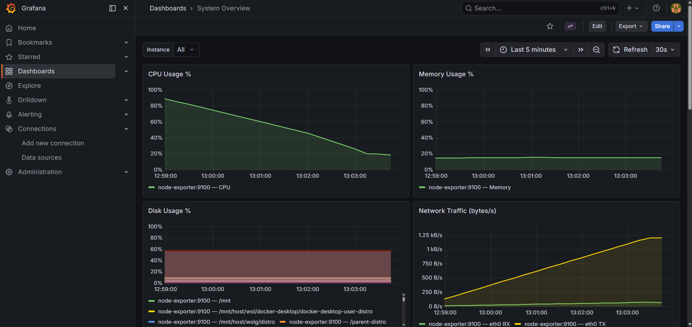
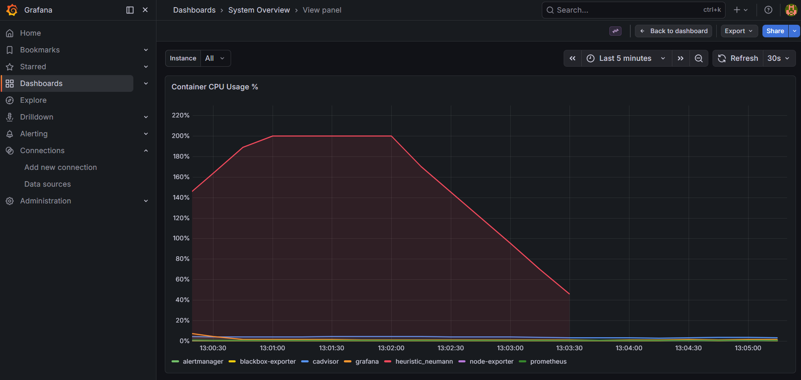
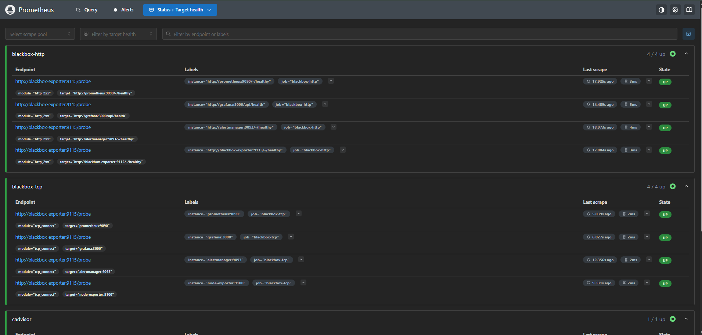
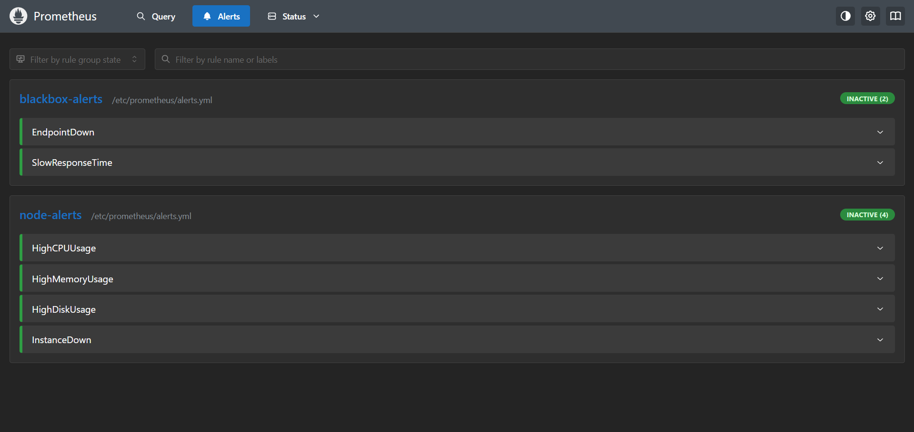
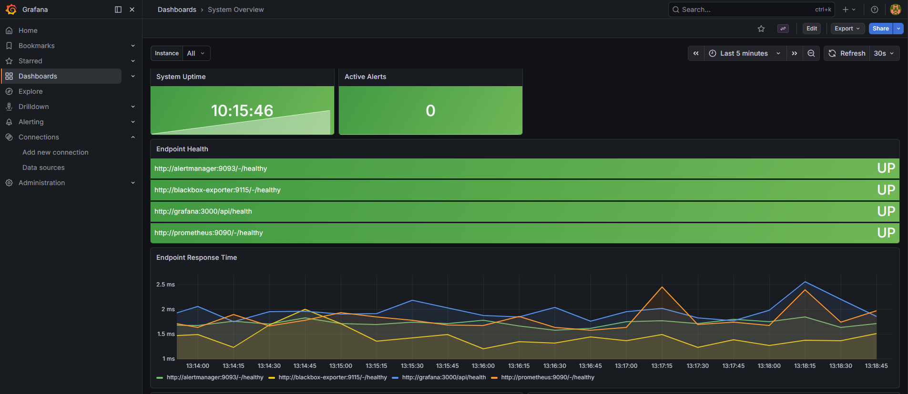

# SRE Observability Stack

A production-style monitoring stack built with Prometheus, Grafana, Alertmanager, Node Exporter, cAdvisor, and Blackbox Exporter. Designed as a hands-on SRE portfolio project demonstrating real-world observability practices.

## Overview

This project simulates a production monitoring environment where you can observe system health, detect anomalies, and respond to incidents — the core workflow of Site Reliability Engineering.

The stack monitors:
- **Host-level metrics** — CPU, memory, disk, network, system load (via Node Exporter)
- **Container-level metrics** — per-container CPU and memory usage (via cAdvisor)
- **Endpoint availability** — HTTP and TCP probing with response time tracking (via Blackbox Exporter)
- **Alert lifecycle** — severity-based routing with inhibit rules (via Alertmanager)

## Architecture

```
┌─────────────────────────────────────────────────────────┐
│                    Docker Network                        │
│                                                          │
│  ┌──────────────┐     scrape     ┌──────────────────┐   │
│  │  Prometheus  │◄───────────────│  Node Exporter   │   │
│  │   :9090      │◄───────────────│  cAdvisor        │   │
│  │              │◄───────────────│  Blackbox Exp.   │   │
│  └──────┬───────┘                └──────────────────┘   │
│         │ alerts                                         │
│         ▼                                                │
│  ┌──────────────┐     visualize  ┌──────────────────┐   │
│  │ Alertmanager │                │     Grafana      │   │
│  │   :9093      │                │     :3000        │   │
│  └──────────────┘                └──────────────────┘   │
└─────────────────────────────────────────────────────────┘
```

## Stack Components

| Component | Version | Port | Purpose |
|---|---|---|---|
| Prometheus | latest | 9090 | Metrics collection & alerting engine |
| Grafana | latest | 3000 | Visualization & dashboards |
| Alertmanager | latest | 9093 | Alert routing & deduplication |
| Node Exporter | latest | 9100 | Host-level system metrics |
| cAdvisor | latest | 8080 | Container-level metrics |
| Blackbox Exporter | latest | 9115 | Endpoint & TCP probing |

## Screenshots

### System Overview Dashboard


### Container CPU — Stress Test
CPU spike captured during a controlled stress test using `stress-ng` inside a Docker container. cAdvisor identifies the exact container responsible.



### Prometheus Targets
All scrape targets healthy — blackbox-http (4/4), blackbox-tcp (4/4), cadvisor (1/1), node-exporter (1/1), prometheus (1/1).



### Alert Rules
6 alert rules across 2 groups — all inactive under normal conditions.



### Endpoint Health
All 4 internal service endpoints monitored and UP.



## Alert Rules

| Alert | Condition | Duration | Severity |
|---|---|---|---|
| HighCPUUsage | CPU > 80% | 2m | warning |
| HighMemoryUsage | Memory > 85% | 2m | warning |
| HighDiskUsage | Disk > 85% | 5m | critical |
| InstanceDown | Target unreachable | 1m | critical |
| EndpointDown | Probe failed | 1m | critical |
| SlowResponseTime | Response > 2s | 2m | warning |

Alertmanager is configured with:
- **Severity-based routing** — critical alerts go to a dedicated receiver
- **Inhibit rules** — if a critical alert fires for an instance, warnings for the same instance are suppressed
- **Grouping** — alerts are grouped by `alertname` and `severity` to reduce noise

## Quick Start

### Prerequisites
- Docker Desktop (or Docker Engine + Compose plugin)
- Git

### Run

```bash
git clone https://github.com/<your-username>/sre-observability-stack.git
cd sre-observability-stack

# Copy and configure environment variables
cp .env.example .env

# Start the stack
docker compose up -d

# Verify all services are healthy
docker compose ps
```

### Access

| Service | URL | Credentials |
|---|---|---|
| Grafana | http://localhost:3000 | admin / see .env |
| Prometheus | http://localhost:9090 | — |
| Alertmanager | http://localhost:9093 | — |
| cAdvisor | http://localhost:8080 | — |
| Blackbox Exporter | http://localhost:9115 | — |

### Stop

```bash
docker compose down

# Stop and remove all volumes (resets data)
docker compose down -v
```

## Project Structure

```
sre-observability-stack/
├── docker-compose.yml
├── .env                          # Local config (not committed)
├── .env.example                  # Template for .env
├── prometheus/
│   ├── prometheus.yml            # Scrape configs + alertmanager integration
│   └── alerts.yml                # Alert rules (node + blackbox)
├── alertmanager/
│   └── alertmanager.yml          # Routing, receivers, inhibit rules
├── blackbox/
│   └── blackbox.yml              # HTTP, TCP, ICMP probe modules
├── grafana/
│   ├── provisioning/
│   │   ├── datasources/
│   │   │   └── datasources.yml   # Prometheus datasource (UID pinned)
│   │   └── dashboards/
│   │       └── dashboards.yml    # Dashboard provider config
│   └── dashboards/
│       └── system-dashboard.json # 13-panel system overview dashboard
└── docs/
    └── screenshots/
```

## Stress Testing

To simulate high CPU load and observe metrics:

```bash
# Run stress test inside Docker (visible to cAdvisor + Node Exporter)
docker run --rm -it --cpus="2" \
  --network sre-observability-stack_monitoring \
  ubuntu:22.04 \
  bash -c "apt-get update -q && apt-get install -y -q stress-ng && stress-ng --cpu 4 --timeout 180s"
```

Watch the **Container CPU Usage %** panel in Grafana — the container name appears in the legend, showing exactly which workload is responsible for the load.

> **Note (Windows/Docker Desktop):** Node Exporter runs inside WSL2 and reports WSL2 VM-level metrics. The `HighCPUUsage` alert threshold may not fire on Windows hosts as the WSL2 VM CPU view differs from the Windows host CPU view. On a native Linux host or cloud VM, alert thresholds behave as expected.

## Key Design Decisions

**Fixed datasource UID** — `datasources.yml` pins the Prometheus datasource UID to `prometheus-ds`. This ensures dashboard JSON references always resolve correctly, making the setup fully portable — `git clone` and `docker compose up` is all anyone needs.

**Named volumes** — Prometheus and Grafana data persists across container restarts. Use `docker compose down -v` only when a full reset is needed.

**Scrape interval** — Set to 15s (not the default 5s). A 5s interval in production causes unnecessary load; 15s is a realistic default for most environments.

**Retention** — Prometheus retains 15 days of metrics (`--storage.tsdb.retention.time=15d`), matching a typical short-term observability window.

## Runbook

Operational procedures for every alert are documented in [`docs/RUNBOOK.md`](docs/RUNBOOK.md).

Each entry covers: what the alert means, likely causes, step-by-step investigation, and resolution.

---

## What This Project Demonstrates

- Infrastructure as Code — the entire stack is defined in config files, no manual UI steps required
- Multi-layer monitoring — host metrics, container metrics, and endpoint probing in a single stack
- Alert design — meaningful thresholds, severity levels, routing logic, and noise reduction via inhibit rules
- Operational thinking — healthchecks, restart policies, named volumes, and config reloading without downtime
